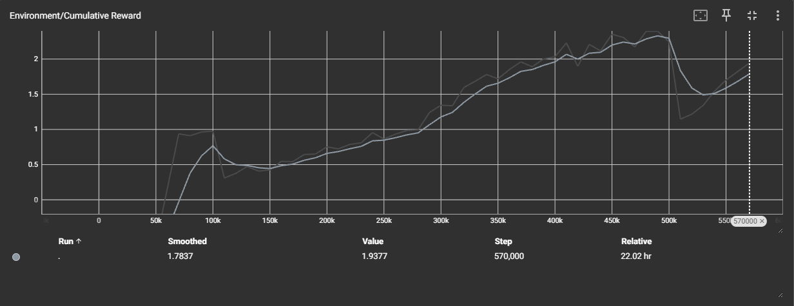
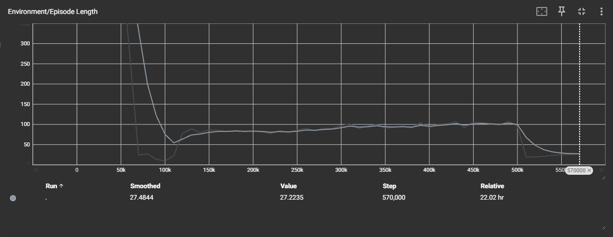
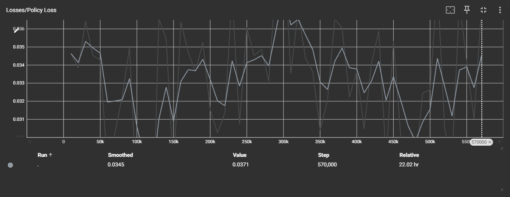
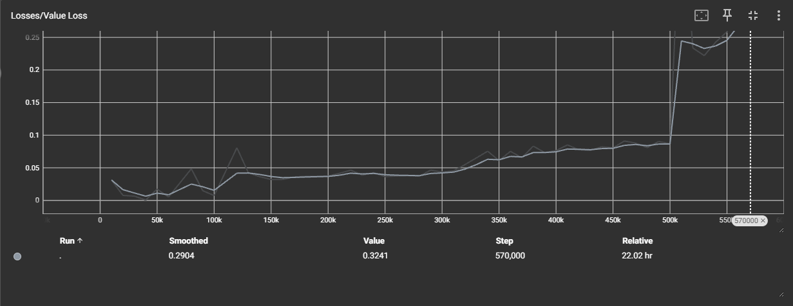

# AI-Powered VR Air Hockey

Een virtual reality retrostijl-airhockeyspel waarin de speler tegen een Ai-agent kan spelen.

## Inleiding

In klassieke airhockeygames zijn tegenstanders vooraf geprogrammeerd met vaste gedragen.
In dit project werd een AI-agent getraind die zelfstandig leert spelen door middel van Reinforcement Learning.
De speler speelt in een virtual reality-omgeving tegen een agent die tijdens zijn trainingsfase geleerd heeft om de puck te slaan, verdedigen en scoren.
Hierdoor kan de speler tegen een dynamische tegenstander spelen warvan het gedrag gebaseerd is op ervaring en niet op vooraf geprogrammeerde regels.

In deze tutorial wordt er uitgelegd hoe een Ai-powered VR airhockeygame wordt opgebouwd met Unity, XR Interaction Toolkit em ML-Agents.
Hier zie je hoe de spelomgeving werd ingericht, hoe observaties, acties en beloningen worden gedefinieerd, hoe de agent wordt getraind en hoe de resultaten kunnen worden geanalyseerd met TensorBoard.

---

# Methoden

## Installatie

### Gebruikte software

| Software | Versie |
|-----------|---------|
| Unity | 6000.x |
| ML-Agents | Release 22 |
| Python | 3.10 |
| TensorBoard | 2.x |
| XR Interaction Toolkit | 3.x |
| Meta Quest SDK | Laatste versie |

## Verloop van de simulatie

### Initialisatie

De gebruiker start in een virtuele VR-omgeving waar een interactieve airhockeytafel voor hem staat.

### Serveerfase

De puck staat in het midden van de tafel en de speler of de AI kan de puck slaan met de pusher.

### Rally

Tijdens de rally beweegt de puck volgens de physics-engine van Unity.

- De puck glijdt over het speelveld.
- De puck kaatst tegen de randen van de tafel.
- De AI-agent analyseert voortdurend de positie en snelheid van de puck.
- De speler reageert fysiek op de bewegingen van de puck.

### Scoring en feedback

Wanneer de puck een doel bereikt:

1. De score wordt bijgewerkt.
2. De puck wordt gereset en gespawnd in de veld van de verliezer van de vorige ronde.
3. Een nieuwe ronde start.

---

## Observaties

De AI-agent ontvangt tijdens elke stap informatie over de omgeving.

| Observatie |
|------------|
| Positie van de AI-paddle |
| Snelheid van de AI-paddle |
| Afstand tussen AI en puck |
| Righting van de AI-paddle naar de puck |
| Snelheid van de puck |
| Positie van het spelersdoel|

---

## Acties

De agent beschikt over twee continue acties.

| Actie |
|--------|
| Beweging op de X-as |
| Beweging op de Z-as |

---

## Beloningen

| Situatie | Beloning |
|-----------|-----------|
| Doelpunt maken | Positieve beloning |
| Doelpunt tegen krijgen | Negatieve beloning |
| Puck raken | Kleine positieve beloning |
| Puck raken maar beland in de speler veld | Kleine negatieve beloning |
| Puck raken en richting het doel duwen | Positieve beloning |
| Richting puck bewegen | Kleine positieve beloning |
| Tijdverspilling | Kleine negatieve beloning |

---

## Beschrijving van de objecten

| Object | Functie |
|----------|----------|
| Air Hockey Table | Speelveld |
| Puck | Object waarmee gescoord wordt |
| AI Paddle | Bestuurd door de AI-agent |
| Player Paddle | Bestuurd door de speler |
| Goal AI | Doel van de AI |
| Goal Player | Doel van de speler |
| GameManager | Verwerkt scores en resets |

---

## Gedrag van de objecten

### Puck

- Beweegt volgens Unity Physics.
- Botst tegen randen en paddles.
- Wordt gereset na een doelpunt.

### AI Paddle

- Ontvangt observaties.
- Verwerkt acties.
- Probeert doelpunten te maken.
- Probeert doelpunten tegen te houden.

### Player Paddle

- Volgt de beweging van de VR-controller.
- Kan de puck raken.

### Goals

- Detecteren doelpunten.
- Geven score-events door aan de GameManager.

---

## One-pager

### Team

- Jamyang Tenzin Jamyang
- Jonathan De Nies
- Lowie Casteels

### Functionele beschrijving

Een virtual reality airhockeyspel waarbij een AI-tegenstander leert reageren op het gedrag van een menselijke speler.

### Meerwaarde van AI

Zonder AI zou de tegenstander bestaan uit een vooraf geprogrammeerd script met voorspelbaar gedrag.
Door gebruik te maken van Reinforcement Learning kan de agent zelfstandig strategieën ontwikkelen op basis van ervaring.
Hierdoor ontstaat een dynamische tegenstander die zich beter aanpast aan het spelverloop.

### Waarom Virtual Reality?

Virtual Reality verhoogt de immersie doordat de speler fysiek aan de airhockeytafel staat.
Door gebruik te maken van natuurlijke armbewegingen en controllerfeedback ontstaat een realistische spelervaring die moeilijk te realiseren is op een traditioneel scherm.

### Interactie

De VR-controller wordt gebruikt als airhockeypusher. De speler kan de puck slaan, verdedigen en doelpunten proberen te maken met natuurlijke bewegingen.
---

# Resultaten

## Trainingsresultaten

### Cumulative Reward

### Episode Length

### Policy Loss

### Value Loss

---

## Beschrijving van de TensorBoard-grafieken

### Cumulative Reward

De cumulatieve reward toont een duidelijke stijgende trend gedurende de training.
In de beginfase behaalde de agent lage beloningen omdat hij nog geen effectieve strategie had ontwikkeld.
Doorheen de training, steeg de reward geleidelijk doordat de agent beter leerde anticiperen op de beweging van de puck en efficiëntere beslissingen nam.
Rond 450.000 tot 500.000 stappen werd de hoogste gemiddelde reward bereikt.
Tegen het einde van de training is een lichte terugval zichtbaar, maar de prestaties blijven duidelijk hoger dan aan het begin van het leerproces.

### Episode Length

De lengte van de episodes daalt sterk tijdens de eerste fase van de training.
Dit wijst erop dat de agent sneller leert reageren op situaties binnen het spel.
Vervolgens stabiliseert de episodelengte gedurende een groot deel van de training.
In de laatste trainingsfase neemt de episodelengte opnieuw af, wat erop wijst dat de agent sneller tot een resultaat komt en efficiënter speelt.

### Policy Loss

De policy loss blijft gedurende de volledige training relatief stabiel.
Kleine schommelingen zijn normaal bij PPO-training en tonen aan dat de agent zijn strategie voortdurend blijft verfijnen.
Er zijn geen extreme pieken zichtbaar, wat erop wijst dat het leerproces stabiel verliep.

### Value Loss

De value loss blijft gedurende het grootste deel van de training laag en stabiel.
Tegen het einde van de training ontstaat een duidelijke stijging.
Dit betekent dat de voorspellingen van de waarde-functie moeilijker werden naarmate de agent geavanceerdere strategieën ontwikkelde.
Ondanks deze stijging bleef de cumulatieve reward toenemen, wat erop wijst dat de agent nog steeds succesvol bleef leren.

## Opvallende waarnemingen tijdens het trainen

- Tijdens de eerste trainingsfase bewoog de agent grotendeels willekeurig.
- Na ongeveer 100.000 stappen begon de agent actief de puck te volgen.
- De agent ontwikkelde zowel aanvallend als verdedigend gedrag zonder expliciet geprogrammeerde strategieën.
- De grootste verbetering in prestaties vond plaats tussen ongeveer 250.000 en 450.000 trainingsstappen.
- Rond 500.000 stappen behaalde de agent zijn beste prestaties.
- Ondanks een lichte daling van de reward op het einde bleef de agent consistent beter presteren dan tijdens de beginfase.
- De uiteindelijke agent was in staat competitieve wedstrijden te spelen tegen een menselijke speler.

---

# Conclusie

In dit project werd een AI-powered VR airhockeyspel ontwikkeld waarin een Reinforcement Learning agent leert spelen tegen een menselijke speler.

De trainingsresultaten tonen aan dat de agent succesvol strategieën kan ontwikkelen op basis van observaties en beloningen.
Hierdoor ontstaat een geloofwaardige tegenstander die zowel verdedigend als aanvallend kan reageren op de acties van de speler.

Persoonlijk tonen de resultaten aan dat Reinforcement Learning geschikt is voor het ontwikkelen van geloofwaardige tegenstanders binnen een VR-omgeving.
De agent ontwikkelde zelfstandig een speelstijl zonder expliciet geprogrammeerde strategieën, wat de meerwaarde van machine learning binnen games duidelijk aantoont.

De combinatie van virtual reality en machine learning zorgt voor een interactieve ervaring waarbij de speler niet tegenover een vooraf geprogrammeerd script staat,
maar tegen een agent die zijn gedrag heeft aangeleerd door training.

---

# Toekomstige verbeteringen

- Implementatie van meerdere moeilijkheidsgraden.
- Langere trainingssessies.
- Complexere beloningsstructuren.
- Multiplayerfunctionaliteit.

---

# Bronvermelding

Peeters, T. (2026). mlagents_2223-deel1 [Cursuspresentatie]. Bachelor Toegepaste Informatica, AP Hogeschool
---
